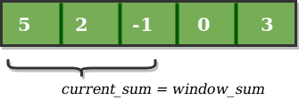
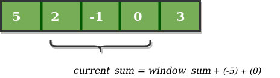
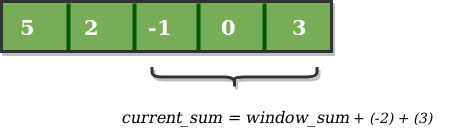

# Ventana flotante (Sliding Window)

## Resumen

Este algoritmo es una forma mucho mas eficiente de resolver cualquier problema que trate sobre **subarrays consecutivos de un array**. El ejemplo mas claro es cuando queremos obtener *el subarray consecutivo mas pequeño cuya suma supere cierto numero x*.

Para resolver esto podemos calcular todas las combinaciones distintas de los elementos consecutivos del array pero eso nos llevaria una complejidad de O(N*k) como minimo. La solucion por ventana flotante lo deja en una complejidad de O(N).

## ¿Cuando usarlo?

Cuando se requiera obtener combinaciones consecutivas de un array de elementos y no se quiera iterar por todos los elementos. Las palabras claves para entender cuando usarlo son:

*Array, String, Sub Array, Sub String, Largest Sum, Maximum Sum, Minimum Sum*

Por tanto, vemos que los problemas que resuelve son cuando en un array queremos obtener la minima o maxima suma de elementos subyacentes

## Alternativas

La alternativa mas burda es iterar por el array entero *k* veces obteniendo una complejidad de _O(N*k)_.


## Variantes

Una variante parecida de este algoritmo es cuando la ventana no tiene un ancho fijo _k_ si no que esta
puede variar segun lo requiera. El ejemplo mas claro de este algoritmo es cuando se busca obtener la ventana mas pequeña que supere un cierto numero _x_. Para esto entonces se usa el mismo algoritmo donde se va sumando el siguiente valor y restando el ultimo y se almacena en otra variable el tamaño minimo requerido para superar o igualar dicho valor.


## Complejidad

Esto nos permite obtener una mejora de **_O(N)_** donde antes teniamos un **_O(N*k)_**

## Ejemplos







## Implementaciones

### Ventana flotante fija

```python
def ventana_flotante_fija(array: List[int], k: int) -> List[int]:
  """Obtiene la mayor suma de las sublistas de tamaño k del array"""
  # Suma inicial de la subarray de elementos
  suma_actual = sum(array[:k])
  maximo = suma_actual

  # Obtenemos cada subarray subsecuente adicionando el siguiente valor (i+k-1)
  # y removemos el ultimo (i-1)
  for i in range(1, len(array) - k + 1):
    suma_actual = suma_actual - array[i-1]
    suma_actual = suma_actual + array[i+k-1]

    if suma_actual > maximo:
      maximo = suma_actual

  return maximo
```

### Ventana flotante dinamica

```python
def ventana_flotante_dinamica(array: List[int], x: int) -> int:
  """Obtiene el tamaño minimo de la ventana que cuya suma supere el numero x"""
  tamaño_ventana_minima = float('inf')

  # Obtenemos el rango y suma de nuestra ventana flotante
  comienzo_de_ventana = 0
  final_de_ventana = 0
  suma_actual = 0

  # Extendemos el final de la ventana flotante hasta que sea mayor a x
  while final_de_ventana < len(array)
    suma_actual = suma_actual + array[final_de_ventana]
    final_de_ventana = final_de_ventana + 1

    # Contraemos el comienzo de la ventana flotante hasta que sea menor a x
    while comienzo_de_ventana < final_de_ventana and suma_actual >= x:
      suma_actual = suma_actual - array[comienzo_de_ventana]
      comienzo_de_ventana = comienzo_de_ventana + 1

      # Actualizamos tamaño minimo de ventana superior a x
      tamaño_ventana_actual = final_de_ventana - comienzo_de_ventana + 1
      tamaño_ventana_minima = min(tamaño_ventana_minima, tamaño_ventana_actual)
  
  return tamaño_ventana_minima

```
