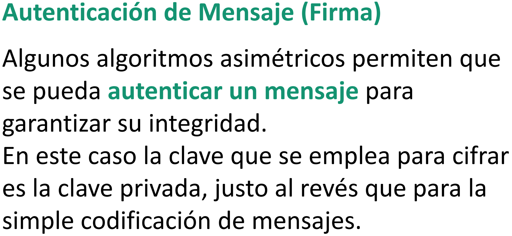

# Seguridad Informática

## Unidad 7 - Gestión de riesgos

### Activos

Todo bien tangible o intangible de la empresa.
La razón por la cual te la quieren poner.

### Amenaza

Eventos que, en caso de ocurrir, te la pusieron. Estas se aprovechan de las vulnerabilidades

### Agente (o Fuente) de Amenaza

Quien te la quiere poner.

### Vulnerabilidad

Condición en la que mas te la pueden poner. Es decir, es un estado de algo/alguien donde las amenazas se pueden dar con mas frecuencia, mas impacto, o ambas.

Por tanto, diremos que algo/alguien esta vulnerable cuando mas expuesto esta, o mas impacto puede recibir.

Normalmente esto se da por ausencia o debilidad de un control.

### Exposición

Instancia en el cual se la pueden poner a algo/alguien.

### Probabilidad de ocurrencia

Frecuencia con la que nos la pueden poner.

### Impacto

Son las consecuencias de nos la pongan.

El **Impacto** (I) resulta del producto entre el Valor (V) de un activo y la Degradación (D) causada por la amenaza.

### Riesgo

El **Riesgo** resulta del producto entre el impacto (I) sobre un activo y la Probabilidad de ocurrencia (P) de una amenaza.

Por tanto, diremos que algo de nuestra empresa esta en riesgo si el impacto que una amenaza ocasiona en el es grande y las probabilidades de que esa amenaza ocurra son altas.


### Valoración de activos

Para ejemplificar la clasificación de datos

#### Confidencialidad

Pueden utilizarlo:

1. Todo el mundo sin ninguna autorización
2. Toda la empresa y entidades externas autorizadas
3. Grupo de empleados que trabaja con ellos
4. Alta dirección

Que alguien haga uso no autorizado de 3 y 4 implica pérdidas graves a la organización.

#### Integridad

Su modificación no autorizada:

1. Puede repararse fácilmente, no afecta la operatoria
2. Puede repararse, afecta levemente
3. Difícil de reparar, afecta significativamente
4. No puede repararse, afecta gravemente a la empresa

#### Disponibilidad

Su inaccesibilidad:

1. No afecta a la operatoria
2. Ocasiona perdidas significativas si es durante 5 días
3. Ocasiona perdidas significativas si es durante 2 días
4. Ocasiona perdidas significativas si es durante 8 horas

### Análisis de riesgos

Existen 2 tipos: el cuantitativo y el cualitativo.

El **cuantitativo** se caracteriza por cuantificar que tan importante son los activos. Es decir, le asigna valores numéricos a las variables involucradas

Ej:


El **cualitativo** se caracteriza por asignar niveles subjetivos de valorización

En comparación, el cuantitativo es un análisis mas amplio, mas objetivo y mas fácil de comprender por la dirección mientras que el cualitativo es un análisis mas subjetivo de la situación

Ej:


### Tratamiento de riesgos

Existen 4 distintos tratamientos para los riesgos: mitigar, aceptar, transferir y evitar

### Mitigar

Poner controles que reduzcan el riesgo. Te pones una pollera mas larga.

Para esto se hace un **análisis de costo-beneficio**

La pregunta es: ¿Me sale mas caro pagar los platos rotos o controlar que nadie los rompa?

El costo del control incluye:

- Costo de adquisición
- Costo de flete
- Costo de instalación y puesta a punto
- Costo de mantenimiento
- Costo de administración

### Aceptar

_"Si la violación es inevitable, relájate y goza"_ diría Cacho Castaña.

La del vago. Asumir que es algo que puede pasar. Para esto es necesario primero definir el **nivel aceptable de riesgo**

Haces las cuentas necesarias, pero en ultima instancia ¡Lo define el patron!

### Transferir

Transfiere el riesgo a terceras partes. El ejemplo mas claro son los e-commerce que derivan el checkout a MercadoPago

### Evitar

Esta es aun peor que la de aceptar. Aca directamente no salimos de casa por miedo a que nos violen.

Eliminamos la actividad que crea el riesgo.

## ISO/IEC 27002

_"Algunos de los principales beneficios de implementar la ISO/IEC 27002 son:

- Mejora la protección de la información confidencial: La norma ayuda a identificar y gestionar los riesgos asociados a la información confidencial.
- Aumenta la confianza de los clientes y socios comerciales: Demostrar un compromiso con la seguridad de la información puede generar confianza y fortalecer las relaciones comerciales.
- Reduce el riesgo de incidentes de seguridad: La implementación de los controles de la norma puede ayudar a prevenir o mitigar los efectos de los incidentes de seguridad.
- Cumple con los requisitos legales: La norma puede ayudar a cumplir con los requisitos de seguridad de la información establecidos por las leyes y regulaciones aplicables."_ - Gemini

### Cositas raras de la ISO/IEC 27002

Los **controles** definidos en la norma 27002 pueden _modificar_ el riesgo o bien _mantenerlo_

Una política de seguridad, por ejemplo, solo mantiene el riesgo mientras que el cumplimiento de la política de seguridad puede modificar el riesgo

Se define la **información de identificación personal (PII)** como cualquier información que pueda servir como vínculo con una persona física.

Se define el **punto de recuperación objetivo (RPO)** al punto en el tiempo en el que se van a recuperar los datos en caso que falle algo.
En criollo, un checkpoint.

Se define el **tiempo de recuperación objetivo (RTO)** como el período de tiempo dentro del cual se recuperarán los niveles mínimos de servicios
En criollo, cuanto demoras en pararte después de la trompada

### Atributos de los controles

Cada control definido en la norma tiene asignado cinco atributos y si, los valores van con un _#_ como si fueran un hashtag

1. **Tipo de control**: Indica el cuándo y cómo el control modifica el riesgo con respecto a la amenaza. Sus valores pueden ser #Preventivo (para que no ocurra), #Detectivo (para saber si ocurrió) y #Correctivo (para corregir lo ocurrido)
2. **Propiedades de seguridad de la información**: Indica que característica de la información busca cuidar el control. Estas pueden ser #Confidencialidad, #Integridad y #Disponibilidad
3. **Conceptos de ciberseguridad**: Enmarca los controles según que hacen. Los valores posibles son #Identificar, #Proteger, #Detectar, #Responder y #Recuperar
4. **Capacidades operativas**: Bueno, estos son muchos...poco importan...engloba según que tipo de control es. Los valores posibles son los títulos de las unidades de esta materia.
5. **Dominios de seguridad**: Según a que dominio de seguridad definido en esta norma aplique el control. Existen 4 grandes dominios que son #Gobernanza_y_Ecosistema, #Protección, #Defensa y #Resiliencia. Cada uno de estos engloba todavía mas tipos

### Diseño de los controles

Cada control tiene un **Título**, una tabla de atributos, el **Control** en cuestión, el **Propósito** y la **Guía** de como implementarlo

## Criptografía

Hoy día el cyber delito es un negoción ya que:

- Lo que robas es pequeño o directamente invisible
- Nunca te conoce tu víctima
- Lo robado, a pesar de intangible, es muy valioso

La criptografía viene a solucionar esto. Esta pretende proteger la información para que nadie no autorizado pueda leerla

El objetivo de esta es que que el costo (tiempo, recursos) para acceder a dicha información sea mayor que el valor que se obtiene de la misma

La criptografía (del griego κρύπτos (kryptós), «secreto», y γραφή (graphé), «grafo» o «escritura», literalmente «escritura secreta») se define como el arte y técnica de escribir con procedimientos o claves secretas o de un modo enigmático, de tal forma que lo escrito solamente sea inteligible para quien sepa descifrarlo

Por su parte, el criptoanálisis es el acto de descifrar el texto


### Los 10 mandamientos de un criptosistema

- No debe existir retardo debido al cifrado o descifrado de la información
- La seguridad del sistema reside en el secreto de una llave y no en la función de cifrado
- Ningún dato público debe conducir a la  llave privada

### Tipos de ataques

#### Known-plaintext attack

Conociendo el texto básico y el texto cifrado busca obtener el algoritmo

#### Ciphertext-only attack

Busca por fuerza bruta obtener las llaves

### Clasificación de los sistemas criptográficos

Estos se pueden clasificar según:

- Su historia: en clásicos y modernos
- El tratamiento de la información: cifrado en bloque o cifrado en flujo
- El tipo de llave utilizada: Con clave secreta o con clave pública

#### Sistemas Clásicos

##### Sistemas de transposición

Estos son los que permutan letras del propio mensaje según un algoritmo dado

El ejemplo mas pavo es el de mover cada letra _x_ posiciones a la derecha

```c
si M es "EL MENSAJE"
y C = transposiciónBásico(M, 3)
entonces C resulta "AJEEL MENS"
```

Si, bien básico...

Existen los sistemas de transposición por grupos como el _ESCÍTALA_


Ademas, existen también los de series, columnas y filas

##### Sistemas de sustitución

Estos sistemas no permutan letras del mensaje si no de todo el alfabeto.

El ejemplo mas pavo es el mismo que en el de transposición pero utilizando el abecedario castellano

```c
si M es "EL MENSAJE"
A es el abecedario "ABCDEFGHIJKLMNOPQRSTUVWYXZ"
y C = sustituciónBásico(M, A, 3)
entonces C resulta "HO PHQVDMH"
```

Por tanto, la primera gran diferenciación que resulta en los sistemas de sustitución es si estos son:

- Monoalfabéticos: un solo alfabeto en la operación
- Polialfabéticos: mas de un alfabeto en la operación

Si nos adentramos en la **historia** de los sistemas de sustitución:

###### Cesar (100 A.C en Roma)

Para la época era una luz


###### Vigenere (1600 en Francia)

Como novedad, este presenta que las letras no siempre se cifran iguales


###### Playfair (1854 en Inglaterra)

Como novedad, este cifrador no era monográmico si no poligrámico.
Esto quiere decir que ya no se cifraba caracter a caracter si no tomando varios caracteres para cifrar.


###### Cifrador Vernam (1917 en EEUU)

Welcome to informática!


#### Sistemas Modernos

Estos se dividen según su tipo de cifrado: **en flujo** o **en bloque**

##### Cifrado en flujo

Aquí el cifrado se hace bit a bit (si, bit, no byte). Aquí la clave es (en teoría) aleatoria y mas larga que el mensaje

El cifrado en flujo simétrico es similar al propuesto por Vernam

Se da que:

1. El espacio de las claves es igual o mayor que el de los mensajes
2. Las claves deben ser equiprobable (osea, aleatorias)
3. La clave se usa una sola vez y luego se destruye (one-time pad)


El mejor ejemplo de cifrados en flujo es el codificador que usamos para ver la televisión. Aquí se cifra bit a bit la transmisión del canal. El mejor ejemplo es cuando vemos un partido de futbol. No serviría utilizar cifrado en bloque por que demoraría mucho y la transmisión necesita ser en vivo.
Por otro lado vemos que cuando falla la señal y/o cable entonces se degrada la imagen del partido, aun asi, logramos entender que es la imagen que estamos viendo distorsionada


##### Cifrado en bloque

Aquí el cifrado se hace a un bloque de información (grupo de caracteres/bytes) usando **la misma clave**


En el ECB con saber la _key_ ya podemos desencriptar el mensaje


Aquí necesitamos saber la _key_ y el _initialization vector_


##### Ventajas y desventajas


###### Claves pública y secretas

La siguiente ilustración nos indica como funciona el cifrado con una sola clave secreta compartida por emisor y receptor


##### Ejemplos

###### Horst Feistel (1970 en Reino Unido)

Este algoritmo tiene la particularidad de que divide el bloque a encriptar en dos mitades, aplica la función de encriptación (F) a solo una de las mitades y luego se permutan las mitades (una o varias veces)


En el siguiente ejemplo se ilustra mejor


###### DES (1976 en Reino)

Básicamente es lo mismo que el Feistel pero con mas complejidad

El Data Encryption Standard (DES) fue el algoritmo estándar utilizado por todo el mundo desde 1976 hasta el 1999. En este año lograron la manera de romperlo en tan solo 22 horas


###### AES (1999)

Como reemplazo del DES llegó el Advance Encryption Standard

Como principal novedad se tiene que este tiene un algoritmo distinto para el cifrado y el descifrado del mensaje


##### Criptosistemas asimétricos

###### Comunicación en canales inseguros


Lo importante de estos algoritmos es que la clave pública que comparto con mi receptor la generé utilizando mi clave privada y la clave pública que el me da la generó con su clave privada. De esta manera mantenemos la privacidad de la comunicación


###### Firmas digitales



De manera similar a lo ya visto, también podemos autenticar mensajes recibidos


Vamos a bajar en limpio lo visto aquí

El punto clave de cambio respecto a lo ya visto hasta aqui es el **punto 3** en donde se envía el mensaje/documento _sin cifrar_

Luego, el emisor (B) también anexa el mismo documento cifrado **con su clave privada** y la clave pública del receptor (A)

El receptor entonces recibe ambos documentos, uno cifrado y uno sin cifrar. Descifra (con su clave privada) el documento cifrado y en caso de que este sea igual al otro recibido entonces puede verificar que fue B quien envió el documento. De esta manera se obtiene el no-repudio en cada comunicación


Obviamente que la solución es híbrida. Esto es, usar un algoritmo asimétrico para establecer una comunicación o firmar un documento especifico. Una ves establecida la comunicación, se usa un algoritmo simétrico de clave secreta

A continuación, algunos ejemplos famosos de algoritmos

###### DSA (Digital Signature Algorithm)

Es parte del estándar de firma digital DSS (Digital Signature Standard) impuesto por el NIST en 1991. Se basa en el problema de los logaritmos discretos

### Hash

El hash es, en resumen, el resultado de aplicarle un algoritmo de hashing a algún archivo

El resultado obtenido es de tamaño fijo sin importar el tamaño del archivo original

A su vez, es imposible obtener dos hashes iguales de dos mensajes distintos

Es importante remarcar que el hash no se puede revertir. Es como meter tu archivo en una licuadora, no hay manera de deslicuar las cosas

Debido a estas características, se utiliza tanto en contraseñas como en firmas digitales


### Firmas digitales con HASH


¿Y si me adulteran la clave pública?

### Certificados digitales


El certificado esta cifrado por la clave privada de la autoridad certificante y todos poseemos la clave pública de esa autoridad

El certificado cifrado contiene la clave pública del usuario

Ejemplo: El certificado de materias aprobadas que uno pide en la UNLaM esta certificado por la CONEAU (Comisión Nacional de Evaluación y Acreditación Universitaria). Esto quiere decir que esa certificación esta encriptada con la clave privada de la CONEAU y en ese certificado se encuentra la clave pública de la UNLaM

